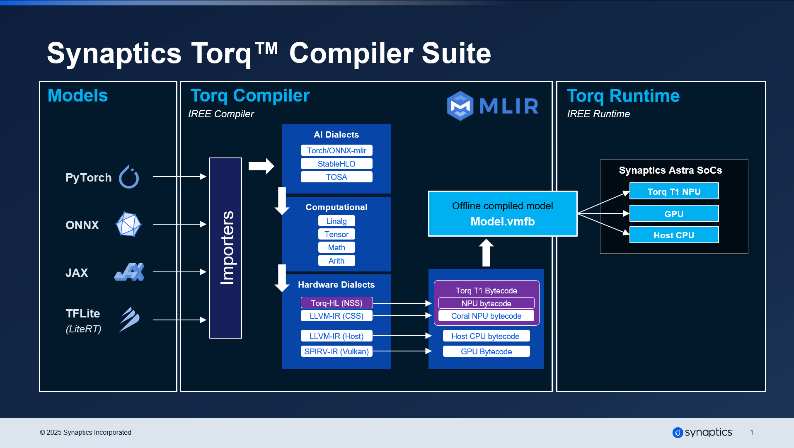

# Synaptics Torq Compiler
This repository hosts the Torq Compiler which enables the compilation of machine learning models for the Synaptics Torq NPU and provides simulation capabilities for the corresponding hardware.

## Documentation
Comprehensive project documentation is available in the [Usage Guide](https://synaptics-torq.github.io/torq-compiler/v/latest/).
