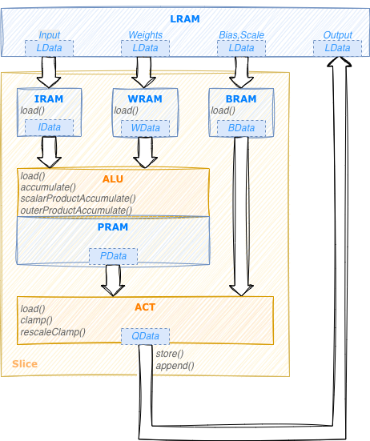

## Kernel Development


### NPU HW Overview

{term}`Torq` NPU consists of a number of processing units called {term}`Slice`.
The slices are independent but share a common local RAM (LRAM). Slices cannot access DRAM directly,
all data, constants, programs and results must be located in LRAM.

Each slice contains an {term}`ALU`, and an activation unit ({term}`Act`): these are {term}`SIMD` units
capable of vector processing. In addition the slice contains a few internal memories that can be used as
caches or transfer buffers.
ALU, Act and the internal memories are connected by programmable transfer agents called {term}`NDL`.

All these components operate in parallel to perfom a computation.

### Programming a Slice

Performing a computation with a Slice requires configuring the ALU, the Act and all the NDLs.
A configuration that performs a specific computation is called a {term}`kernel`.

Developing a kernel that runs on a Torq Slice using low-level HW APIs to program
each unit directly is a complicated activity. Complications are due to multiple reasons:

1. Programming a vectorized architecture is intrinsically harder then normal {term}`SISD` programming
  and requires correct data organization and processing to exploit parallelism

2. Idiosyncrasies and peculiarities in the HW (HW is optimized for efficiency not for easiness of programming)

3. Each NDL must be programmed with the counts, strides and offset of the data to be trasferred.
   Working with mutiple groups of counts and strides is unnatural and error-prone.

4. Multiple parallel but interdependent data flows are difficult to grasp by SW people


How can we write efficient kernels without getting lost in this complexity?

1. Carefully design the data organization (e.g.: put data that can be processed together close to
   each other, provide adequate alignement and padding if needed). Design the processing
   to reduce the number of times the same data is copied in/out from local memory.

2. Encapsulate the specific HW behaviour inside higher-level operations
   This allows us to provide a logical "instruction set" for the NPW which abstract
   the HW details (eg. multiplyAccumulate instruction)

3. Organize the data in multi-dimensional tensors with a shape and element type.
   Let the internal implementation take care of the corresponding sizes, strides and offset
   (same idea as numpy).
   
4. In our Torq Slice the data flows (represented by the NDLs) are running in parallel but they
   are not completely independent, actually they must be exactly syncronized in order to
   get the correct results.
   Even if we have about 10 of these data flows, they represent one single computation.
   Let's express the overall computation once and derive all the data flows from there.
   
*EasyKernel* is a library designed to help kernel writers with points 2. 3. and 4.
It allows to generate the low-level settings and NDLs configuration from a more natural
higher-level description.

Even with this support, kernel writing is definitely not *easy*: organizing data in a proper way and 
using the right instructions to parallelize processing as much as possible remains an important 
design challange.


### EasyKernel

EasyKernel provides a C++ API that allows to express a kernel using high-level constructs.
It provides a simplified logical view of a Torq Slice that abstracts many of the details
and complexities of the underlying HW implementation.

The picture here below shows a logical diagram of a Slice as presented by the EasyKernel library:



The slice contains:

- 2 computational units (ALU and Act)
- 4 internal memories: IRAM, WRAM, BRAM used as cache or temporary buffers to contain
    respectively input, weights and (bias,scale) values. PRAM is used by ALU as a working memory
    to contain partial results.
    
Each unit provides its own instruction set.
PRAM has no instructions since it is controlled directly by the ALU.
The NDL data-transfer engines are not represented in this view since their configuration is derived
implictly from the instructions of the other components.

``LData`` structures are used to repesent n-dimensional tensors in LRAM.
Each tensor has a data type and *n* dimensions, each with its own element count and stride.
Representing the strides explicitly provides a natural way to represent data which is not 
contiguous in memory. The concept is very similar to that of a ``MemRef`` in ``MLIR``.
In the same way we use ``IData``, ``WData``, ``BData``, ``PData`` structures
to represent tensors in IRAM, WRAM, BRAM and PRAM respectively.
These data structures all work essentially the same, the main difference is the physical location
of the data they represent.

EasyKernel allows to express a kernel as a *sequential program* using these instructions and data types.
It's important to keep in mind that despite this illusion of sequentiality, during execution
all the unit in a Slice will actually operate in *parallel*.

The best way to explain how to write a kernel is probably with an example.
In the following sections we will see how to write a simple kernel that performs elementwise multiplication
of two input tensors. We will start with some strict assumptions on the format of the input data
and then see how to extend the kernel to be completely generic while still being as efficient as possible.

### Tutorial

#### Vector Multiplication (basic)

The easiest way to start writing a kernel is to use the Slice as a scalar ({term}`SISD`) processor
on input tensors with a known shape.

**Required kernel behaviour**:
receive in input two tensors of rank 1 and generate in output a tensor
containing the rescaled elementwise products of the inputs, clamped to a specified min and max values.
Each output value must be computed as:

```out[i] = clamp((input1[i] * input2[i] + bias) * scale, min, max)``` 

In this example the bias and scale values will be the same for all the elements.

The first thing to do when developing a kernel is to define the data tensors in LRAM on which the
kernel will operate.
Normally the data shape, layout, and type of these tensors cannot be decided by the kernel but come from
higher-level compiler passes via `MemRef` structures.
Each `MemRef` is associated to an operand of an MLIR *operation* and can be accessed with the name of the operand.
Conveniently ``LData`` objects can be created directly from MLIR operands.
We also create a ``Slice`` object that will allow us to express the
computation using high-level instruction and translate them to the corresponding HW and NDL configuration.

```{code} C++
Slice slice;
LData input1(op.getInput1());
LData input2(op.getInput2());
LData biasScale(op.getScaleBias());
LData output(op.getInit());
```

In addition to operands, MLIR operators also have *attributes* that can also be accessed by name,
so we can get the min and max output values, and the shift needed for the rescale:

```{code} C++
const int outMin = op.getOutputMin();
const int outMax = op.getOutputMax();
const int shift = op.getShift();
```

It's also always a good idea to verify that the tensors are as expected:

```{code} C++
// Verify inputs are 1D and same length
assert(input1.shape().size() == 1 && input2.shape().size() == 1);
assert(input1.dim(0) == input2.dim(0));
```

Now that the data definition is completed we can start to define the algorithm to perform the processing.
The Torq Slice is not able to use data from LRAM directly, we have first to bring them to one of the
internal memories (IRAM, WRAM or BRAM). In our case the biasScale tensor is very small (it contains
only one [bias, scale] pair) so we can simply bring it to internal memory once
at the beginning and leave it there.

```{code} C++
BData bdata = slice.bram.load(biasScale);
```

Now we can start specifying the processing. The idea is to perform the same computation for all the
elements in the input tensors, one value at a time. We need a for loop:

```{code} C
For(auto i = slice.iterate(input1.dim(0))) {
    // Body of the processing to be added here
}
```


:::{important}
The uppercase *F* in the above code is not a typo. And this is *not* a real C++ loop.
This is just a syntactic representation of a loop that will be executed by the Slice.
:::

We can see ``iterate(N)`` as a method that creates an *iterator* representing a loop that will be repeated *N* times.
Here *N* is ``input1.dim(0)`` that is the number of elements in the first (and only) dimension in input1.
Each iterator internally contains an *iteration variable* that represents a runtime
index incrementing from 0 to *N*-1. We can use these iteration variables as indexes to extract parts
of the data tensors.


Now let's fill the body of our loop.
We can access values in the LData tensors by indexing them as we would do with standard arrays and
multiply each element of the first input by the corresponding element of the second input.
The ``Alu`` class contains the full list of instruction it supports.
Two of them could be used here: ``scalarProductAccumulate`` or ``elementwiseProductAccumulate``.
In the former the second operand must be a scalar, while in the latter it can be a scalar or a vector.
We use ``elementwiseProductAccumulate`` since it will be compatible with the improved versions
of this kernel what we will develop below.

Since both arguments contains one single value, the resulting `pdata` will also contain one single value.
We can rescale and clamp this value using the activation unit (``rescaleClamp`` instruction in the ``Act`` class)
and store the result in the output tensor.

This completes the definition of the kernel, here the complete code:

```{code} C++
// Verify inputs are 1D and same length
assert(input1.shape().size() == 1 && input2.shape().size() == 1);
assert(input1.dim(0) == input2.dim(0));

BData bdata = slice.bram.load(biasScale);
For(auto i = slice.iterate(input1.dim(0))) {
    IData data1 = slice.iram.load(input1[i]);
    WData data2 = slice.wram.load(input2[i]);
    PData pdata = slice.alu.elementwiseProductAccumulate(data1, data2);
    QData res = slice.act.rescaleClamp(pdata, bdata, shift, 0, outMin, outMax);
    slice.store(output[i], res);
}
```

We can now ask the `Slice` object to provide the corresponding HW settings and NDLs configuration using
the ``getCfgAttr()`` and ``getNdls()`` methods.

Using the Slice as a scalar processor is not very different from writing the same operation in C
for a standard CPU. Of course this is not using the full computational power of the Slice, 
we will see how to improve this in the next version of this kernel.

:::{note}
Writing a basic version of a kernel operating one element at a time can often be a good
way to start designing a kernel, since this doesn't require any specific data organization and
can provide a reference against which to benchmark more optimized implementations.
:::


#### Vector Multiplication (vectorized)

In this example we examine how to improve the previous version of the kernel to take advantage
of the vector processing features of the ALU and Act units.

The idea is similar to what we have seen before, but instead if operating on one value at a time
we operate on *vector* of values at a time. Of course this is only possible if the data in the input and
output vectors are contiguous, that is if they are *dense* tensors, so we have to check that this
is indeed the case:

```{code} C++
// Verify inputs and output and dense
assert(input1.denseDims() > 0 && input2.denseDims() > 0 && output.denseDims() > 0);
```

In order to be able to process multiple input values at a time we need two things:

1. determine how many values can be processed in parallel, that it the size of the input vectors

2. split the input tensors in vectors of the given size

The vector size depends on the data type and the HW unit that we want to use.
Since the ALU can support bigger vector sizes than the Act, but we want to use the same vecors for both,
we ask Act to provide its maximum vector width for the input and weight types we want to use:

```{code} C++
int vectorSize = slice.act.width(input1.elementType(), input2.elementType());
```

Now we can partition each input vector in chunks (vectors) each containing vectorSize elements.
For the moment let's also vectorize the output tensor, we will see soon why this is not a good idea.

```{code} C++
input1.vectorize(vectorSize);
input2.vectorize(vectorSize);
output.vectorize(vectorSize);  // /!\ Vectorizing output is deprecated
```

What happens here is that the input and output tensors are reshaped from a vector of shape ``[N]``
to a 2D tensor of shape ``[N / vectorSize, vectorSize]``.
So while in the previous example ``input1[i]`` was referring to a single element, the same syntax
applied to the 2D tensor above will actually refer to a *vector* of ``vectorSize`` elements. 
The intersting thing is that since the instructions we used inside the *For* loop in the previous
example (load, store, elementwiseProductAccumulate, rescaleClamp) are all able to work on vectors
of data, there is no need to apply any change to the loop itself, instead of iterating on all the
data elements it will now iterate on all the data *vectors*. By adding the few lines above we
have transformed the tensor multiplication kernel into one using vector operations.
This new kernel is typically about 10 times faster than the original one (the exact number
depending on the data types).


We still have an important point to address: what happens if the vector size `N` is not a multiple of
`vectorSize`?

When we `vectorize()` a tensor, its size will become a multiple of the specified `vectorSize`.
For the input tensors this is not a real issue, the last vector will go beyond the end of the
data, so the final elements will contain `junk` data. Processing junk data is completely legal
as long as they are not used as to compute the valid part of the result.

For the output tensor the situation is different: it is not allowed to write beyond the end of the
tensor, since this will corrupt whatever information is there.
This is checked by the compiler so if we try to use our vecotorized kernel on an data vector that
is not multiple of ``vectorSize`` we will get a compile-time error.

One possible solution is for the kernel to explicitly request its output to be `padded`.
In this way the junk result values from the last vector will safely end up in a padding area that is not used
for anything else. While this approach works, the addition of this additional padding area to the output
tensor can in some cases bbecome quite annoying, for example when working on subviews of existing tensors.

A better solution is to avoid going beyond the end of the output tensor in the first place.
Luckily this can be achieved with a simple change to our kernel.

Instead of writing the result to the output tensor using the ``store()`` instruction,
we can use the ``append()`` instruction.
Append will append the given result to what has already be written in the indicated output (sub)tensor.
So ``slice.store(output, res)`` will append `res` to the results already written in the
output tensor in previous iterations. In the same way ``slice.store(output[i], res)`` will append `res`
to the results already written in the `output[i]` subtensor in previous iterations.
What makes ``append()`` so useful is that it never overflows the size of the output (sub)tensor it is writing.
For example if we try to append two 16-bytes results to a tensor of size 20, the first append will write the
entire 16 bytes, while the second append will just write the initial 4 bytes and discard the remaining 12.

In order for this to work we just have to make sure not to modify the size of the output tensor,
this is why we shall `never` apply ``vectorize()`` to an output tensor.

Here is the final code of our vectorized kernel working on any dense 1D input of any size without any padding:

```{code} C++
// Verify inputs are 1D and same length
assert(input1.shape().size() == 1 && input2.shape().size() == 1);
assert(input1.dim(0) == input2.dim(0));

// Verify inputs and output are dense
assert(input1.denseDims() > 0 && input2.denseDims() > 0 && output.denseDims() > 0);

// Vectorize inputs
int vectorSize = slice.act.width(input1.elementType(), input2.elementType());
input1.vectorize(vectorSize);
input2.vectorize(vectorSize);

BData bdata = slice.bram.load(biasScale);
For(auto i = slice.iterate(input1.dim(0))) {
    IData data1 = slice.iram.load(input1[i]);
    WData data2 = slice.wram.load(input2[i]);
    PData pdata = slice.alu.elementwiseProductAccumulate(data1, data2);
    QData res = slice.act.rescaleClamp(pdata, bdata, shift, 0, outMin, outMax);
    slice.append(output, res);
}
```

:::{important}
Use ``vectorize()`` to reorganize the *innermost* dimension of input tensors for vector processing.
Never vectorize output tensors. Use the ``append()`` instruction to write vector results to output
without overflow.
:::


#### Tensor multiplication (vectorized)

In practice the input and output tensors of an elementwise mul operation are not required to be
vectors with one dimension, they can have any number of dimensions as long as the tensors have the same shape.
Let's see how to extend our kernel to handle this.
For the case of rank-2 tensors, the change would be trivial, instead of one `For` loop,
we would now need two nested loops:

```{code} C++
For(auto i = slice.iterate(input1.dim(0))) {
    For(auto j = slice.iterate(input1.dim(1))) {
        IData data1 = slice.iram.load(input1[i][j]);
        WData data2 = slice.wram.load(input2[i][j]);
        PData pdata = slice.alu.elementwiseProductAccumulate(data1, data2);
        QData res = slice.act.rescaleClamp(pdata, bdata, shift, 0, outMin, outMax);
        slice.append(output, res);
    }
}
```

For the case of rank-3 tensors, the change would be trivial as well, we simply need 3 loops. The problem
is that we don't know a priori how many dimensions the tensors can have, and writing an explicit
implementaton for each possible rank is tedious end error prone.

For these situations it is very convenient to use an extension provided by the ``iterate()`` method.
Instead of passing a single iteration couter, it's also possible to pass a vector of counters.
In this case we will get as return value not a single iterator but a *vector of iterators*,
for simplicity we call this a *multi-iterator*.
A single `For` loop on a multi-iterator with `M` elements will be expanded to `M` loops,
each with its own counter. A multi-iterator will contain a *multi-iteration-variable*
that can be used to index multiple dimension of a tensor at once.

As concrete example consider the following code:

```{code} C++
For(auto m = slice.iterate({4, 7})) {
    IData data = slice.iram.load(input[m]);
    // ...
}
```

It is equivalent to the code here below:

```{code} C++
For(auto i = slice.iterate(4)) {
    For(auto j = slice.iterate(7)) {
        IData data = slice.iram.load(input[i][j]);
        // ...
    }
}
```

The number of elements in the vector of counters passed to `iterate()` can be arbitary, including 0 elements.
In this case the multi-iterator will be equivalent to no loops at all:

```{code} C++
For(auto m = slice.iterate({})) {
    IData data = slice.iram.load(input[m]);
    // ...
}
```

is equivalent to:

```{code} C++
IData data = slice.iram.load(input);
// ...
```

With this functionality it's trivial to write a version of the mul kernel that works with any input rank,
all we have to do is to replace the single iterator with a multi-iterator iterating on all the tensor
dimensions except the last one. Remember that the last dimension is the one representing the *elements*
of data vectors that we wqnt to process. If we iterated also on this dimension we would be back
processing one element at a time.
We can express "*all the input dimensions except the last one*" as
``input1.dim(0, input1.shape().size() - 1)`` or equivalently as ``input1.dim(0, -1)`` (negative
indexes count from the end as in numpy).

To resume, the change to support tensors of arbitrary rank consist of replacing the line:

```{code} C++
For(auto i = slice.iterate(input1.dim(0))) {
```

with:

```{code} C++
For(auto i = slice.iterate(input1.dims(0, -1))) {
```

Here the full code:

```{code} C++
// Verify that inputs have the same rank and the same count in each dimension
assert(input1.dims() == input2.dims());

// Verify inputs and output inner dimensions are dense
assert(input1.denseDims() > 0 && input2.denseDims() > 0 && output.denseDims() > 0);

// Vectorize inputs
int vectorSize = slice.act.width(input1.elementType(), input2.elementType());
input1.vectorize(vectorSize);
input2.vectorize(vectorSize);

BData bdata = slice.bram.load(biasScale);
For(auto i = slice.iterate(input1.dims(0, -1))) {
    IData data1 = slice.iram.load(input1[i]);
    WData data2 = slice.wram.load(input2[i]);
    PData pdata = slice.alu.elementwiseProductAccumulate(data1, data2);
    QData res = slice.act.rescaleClamp(pdata, bdata, shift, 0, outMin, outMax);
    slice.append(output, res);
}
```

Note that we didn't change the assert on the dimensions being dense. This is because we actually
need only the *innermost* dimension to be dense, so that we can vectorize it.
We don't care about upper dimensions being dense or not since the multi-iterator will automatically
get the correct count and stride for each dimension from the `LData` structure.


:::{important}
`multi-iterators` and the corresponding `multi-indexes` allow to handle in a generic way
computations involving a variable number of dimensions. A multi-iterator can be created by
calling the Slice ``iterate()`` method with a vector of counters.
:::

:::{important}
``LData::dim(int index)`` returns the number of elements in the specified dimension.
``LData::dims(int begin, int end)`` returns a vector with the number of elements in the dimensions
from `begin` (included) to `end` (excluded). Negative indexes are interpreted from the end as in numpy.
:::

#### Tensor multiplication (optimized)

There is still a case where the n-dimensional mul kernel we've seen in the previous section is
sub-optimal. Imagine that both inputs and output are *dense* tensors with many small dimensions,
for example [5, 3, 3, 2]. Our kernel will vectorize the innermost dimension, giving 1 single vector of 2 elements.
Then it will iterate 5 * 3 * 3 times to process all the elements. But since the tensors are dense
we could have used bigger vectors than with just 2 elements, this would have required much less iterations.

The idea to improve performnce in these cases is to *fuse* together as many inner dimensions as
possible. Of course we can only fuse dimensions that are dense. Dimensions that have "*holes*" in the
data, that is that use non-natural stride cannot be fused. Furthermore since an elementwise
kernel requires the input and output tensors to have the same rank, we can only fuse two nearby
inner dimensions if they are dense in *both* inputs *and* ouput tensors.
Note again that we are only talking about *inner* dimensions.
After we find a non-dense dim we don't care if outer dimensions are dense or not, we will not be able
to fuse them anyway.
The `LData` class provides several *tensor-editing* method, we have already used `vectorize()` we will
now use `fuse()`:

```{code} C++
// Count how many dense inner dimensions we have in input and output
int inDenseDims = std::min(input1.denseDims(), input1.denseDims());
int outDenseDims = output.denseDims();

// Fuse dense dimensions in all the tensors
int denseDims = std::min(inDenseDims, outDenseDims);
input1.fuse(denseDims);
input2.fuse(denseDims);
output.fuse(denseDims);
```

After this fusion, all tensors will have one inner dense dimension (as big as possible) and possibly
additional outer dimensions as needed. The rest of the code will remain unchanged. Vectorization
will now operate on a larger inner dimension, and so will be able to make full use of the max
vector size supported by the Slice. The above code is completely generic and will work also in
the case where there is no dense dimension at all.

Another feature that is quite useful in elementwise operations like mul is *broadcasting*.
Broadcasting is a mechanism that allows to perform elementwise operations on arrays of different
shapes and sizes without making unnecessary copies of data. For example if this operator
receives input1 having shape [2, 5, 7] and input2 having shape [1, 1, 1] to generate an output
of shape [2, 5, 7], we would like all elements in tensor1 to be multiplied by the single element in input2.
This can be implemented using tensor editing, using the `broadcastAs()` method.
It will adapt the number of elements in an input tensor to make it equal to the number of
elements in a given output tensor, while at the same time setting the strides correctly 
so that the elements in the broadcasted dimensions will be repeated as many times as needed
without being physically duplicated. This is normally done right at the beginning of the kernel
before vectorization is applied:

```{code} C++
// Apply implicit broadcasting
input1.broadcastAs(output);
input2.broadcastAs(output);
```

With the above code we can remove the requirement that the two inputs must have the same rank.
Of course the input and output tensors must be compatible for broadcast, otherwise we will get a
compile error.

Here is the final version of our mul kernel (we have combined fusion and vectorization).
This doesn't look very different from the basic version we have shown at the beginning,
but it can support tensors of any element type, any rank, dense or not dense, broadcasting without
data copy, does not require any special memory padding and is optimally efficient.

```{code} C++
// Apply implicit broadcasting
input1.broadcastAs(output);
input2.broadcastAs(output);

// Count how many dense inner dimensions we have in input and output
int inDenseDims = std::min(input1.denseDims(), input1.denseDims());
int outDenseDims = output.denseDims();
int denseDims = std::min(inDenseDims, outDenseDims);

// Fuse and vectorize inputs
int vectorSize = slice.act.width(input1.elementType(), input2.elementType());
input1.fuse(denseDims).vectorize(vectorSize);
input2.fuse(denseDims).vectorize(vectorSize);
output.fuse(denseDims);

BData bdata = slice.bram.load(biasScale);
For(auto i = slice.iterate(input1.dims(0, In::Elements))) {
    IData data1 = slice.iram.load(input1[i]);
    WData data2 = slice.wram.load(input2[i]);
    PData pdata = slice.alu.elementwiseProductAccumulate(data1, data2);
    QData res = slice.act.rescaleClamp(pdata, bdata, shift, 0, outMin, outMax);
    slice.append(output, res);
}
```

:::{important}
`fuse()` allows to fuse multiple *dense* dimensions into a single dimension.
This can provide a performance improvement, in particular on tensors with small inner dimensions.
For consistency always fuse the *same number of dimensions* in input and output.
:::

#### Matrix Reduce

In the *mul* examples above we used the `elementwiseProductAccumulate` instruction, but we didn't really
accumulate anything, we just multiplied two different vectors at each iteration.
To see how accumulation works we show in this example a simple *reduce* kernel.

**Required kernel behaviour**:
Reduce a 2D matrix along the first axis, that is given a [*N*, *M*] matrix, all the rows have to be added
together to produce a single vector with [*M*] elements. Each element must saturate to the
*min* and *max* values of the output data type.
For simplicity we assume the inner dimension is dense, that is the elements of each row are contiguous.

The kernel structure will be similar to what we've already seen:

1. create LData objects from the operands of the MLIR operation
2. check they look as expected
3. vectorize the input
4. loop over the input data to compute the result

For kernels working on tensors with a fixed shape as this one, it's always suggested to use
named constants to refer to the tensor axis instead of hardcoded tensor indexes; this makes
the code more readable and makes explicit the expected structure of the tensors.
The easykernel library contains a few predefined enums for this, each kernel can define its own locally.
In this case our input will have two dimensions, and will be vectorized so we can represent it as:

```{code} C++
struct In : Vectorized {
    enum { Rows, Cols };  // Input is a 2D array that we vectorize
};
```

Defining the enum inside a *struct* provides a scope for the names and makes it easy to inherit
predefined enum values as needed (here we inherit the ones from the `Vectorized` structure).

We define the *LData* tensors from the MLIR operands as usual, we only have one input and one
output in this kernel, no bias tensor:

```{code} C++
// Setup input and output tensors
Slice slice;
LData input(op.getInput());
LData output(op.getInit());
DType outType = output.elementType();

// Input must be 2D with dense rows, output must be 1D dense
assert(input.shape().size() == 2 && output.shape().size() == 1);
assert(input.dim(1) == output.dim(0));
assert(input.denseDims() > 0 && output.denseDims() > 0);
```

Since the rows are dense we can vectorize them to improve performace.
Which vector size should we use? In the previos *mul* examples we used the *Act* width because
this vector size is guaranteed to also work with the *ALU*. We could do the same here, but when
we are accumulating over multiple input values to generate an output, using the same vector size for the 
*ALU* and the *Act* would be inefficient. *ALU* supports a larger vector size than the *Act* 
so it is convenient to accumulate with the *ALU* using this bigger vectors.
Once we have completed the accumulation we can split the partial result in smaller sub-vectors
and process them with the *Act*. Since *ALU* and *Act* are operating in parallel, this allows
to everlap the accumulation loop in the *ALU* with the sub-vector processing loop in the *Act*.

The `Alu::iWidth()` method returns the max input vector size for the given input and weight type.
We don't have weights here, so we pass *None* as the second parameter.

```{code} C++
int vectorSize = slice.alu.iWidth(input.elementType(), DType::none);
input.vectorize(vectorSize);
```

At this point the vectorized input is a 3D tensor of shape [N, M / vectorSize, vectorSize],
enabling us to operate on *vectorSize* elements at a time.
Since in this kernel we just want to accumulate over the input rows we can use the simpler
`accumulate()` instruction instead of `elementwiseProductAccumulate()`.

The main processing will consist of two nested loops, the outer one iterating over all the
column vectors, the inner one accumulating this column vector across all the input rows.

```{code} C++
// For all the columns (column vectors actually)
For(auto c = slice.iterate(input.dim(In::Cols))) {
    PData pdata;
    // Accumulate across the reduce dimension
    For(auto r = slice.iterate(input.dim(In::Rows))) {
        IData idata = slice.iram.load(input[r][c]);
        pdata = slice.alu.accumulate(idata);
    }
```

The `pdata` contains the accumulated partials that we have to process with the *Act*.
As we explained, the *Act* is not able to process all these values at once, we need an additional
loop to process them one chunk (sub-vector) at a time. This is quite easy to do as `pdata` 
is a 2D tensor, basically the inner dimension consist of vectors of the right size to be processed
by the *Act* in one go. We can use the predefined `PData::Vectors` enum index to iterate over them.
Since we don't need to rescale we can use the `clamp()` instruction instead of `rescaleClamp()`:


```{code} C++
    // Clamp the accumulated result
    For(auto av = slice.iterate(pdata.dim(PData::Vectors))) {
        QData res = slice.act.clamp(pdata[av], minVal(outType), maxVal(outType));
        slice.append(output, res);
    }
}
```

:::{note}
Using the techiques we've seen up to here it is straightforward to adapt this example to work
for an input tensor of any rank (dense or not) and any reduce axis
:::

:::{important}
For accumulating kernels always use the largest vector size supported by the *ALU*.
The generated partial result will be vectorized correctly for processing by *Act*
:::


### Reference


#### Kernel Structure

The structure of the kernels in the tutorial above is quite typical.
Each kernel must contain the following mandatory instructions:

- One single ``alu`` instruction (specifies the behaviour of the ALU unit)
- One single ``act`` instruction (specifies the behaviour of the activation unit)
- One single ``store`` or ``append`` instruction (to store the result of the computation to LRAM)

In addition a kernel normally contains a combination of the following instructions:
- ``load`` instructions to bring data from LRAM to the internal memories (up to one load instruction
  for each of IRAM, WRAM, BRAM)
- ``For`` loops to repeat the computation over all the data to be processed
  (a loop can contain both the `alu` and `act` instructions, or only one of them)
- additional configuration instructions as needed

It's important to point out the role of the ``load`` instructions, even if they are conceptually
very simple they are critical in the design of a kernel since they give the kernel writer full control
on *which* data to bring to an internal memory and *when*. Ideally load instructions should be put
in the most outer loop possible to avoid loading the same data multiple times from LRAM.


#### ALU Instructions

The *ALU* provides a set of instructions that can be used to process the input and weight data.
Most of them implement a variant of *multiply-accumulate*: at each iteration each value *i*
in the PRAM is updated according to the following formula:

```pdata' = pdata (+) input * weight```

where `(+)` represents the *accumulate* operation to be used (by default `add`).

Here the available instructions:

- ``load(idata)``: simply load the input vector in the partials (PRAM)

- ``accumulate(idata)`` add an input vector of *N* elements to the current partials

- ``scalarProductAccumulate(idata, wdata)``: multiply an input vector of *N* elements with a scalar weight
    (or weight vector with 1 element) and add to the current partials

- ``multiScalarProductAccumulate(idata, wdata)``: like *scalarProductAccumulate* but the input must be
  a matrix *[M, N]* and wdata a vector with *M* elements. Each input row is multiplied by
  the corresponding weight and the entire result added to the current partials.

- ``outerProductAccumulate(idata, wdata)``: perform the outer product between an input vector with
*N* elements and a weight vector with *M* elements generating a matrix of *[M, N]* products which
are added to the current partials.

- ``elementwiseProductAccumulate(idata, wdata)``: multiply element by element an input vector with
*N* elements and a weight vector with the same number of elements, generating a vector of *[N]* products
which are added to the current partials.

More details are provided directly in the `Alu` class.
The difference between these instruction is in the expected shape of the input and weight tensors they
expect, and in how they are used in the computation.
Which instruction to choose depends on the nature of the computation that we want to implement.
Some of the instructions are easier to use, for example `scalarProductAccumulate` can also work
with simple scalars, in which case no special care has to be taken in the layout of the data,
sice we can access any element we want by indexing the input and weight tensors.
Other instructions are more complex to use, for example `outerProductAccumulate` requires
the input elements to be adjacent in memory, same for the weights values.
This ofter requires some effort to ensure the layout of the input and weights in memory
respects these requirements. On the other hand this is also much more efficient in the utilization
of the *ALU*, since it can perform *N * M* multiply-accumulate operations in one single cycle,
so when it can be used the payoff can be significative.


#### Vectorization

Vectorization consists of partitioning input data in *vectors* so that multiple input and/or weight
values can be processed in parallel. This can be done by calling the `vectorize()` method on the `LData`
object to vectorize. This method takes in input the size (number of elements) of the desired vector.
For special situations such as convolution it is also possible to pass a second parameter to indicate
the *stride* between nearby vectors, but this is normally not needed.
Only the innermost dimension of a tensor can be vectorized. Vectorization will fail if this
dimension is not *dense*. To vectorize additional dimensions, they must be *fused* beforehand.

Choosing the right vector size is important for optimal performance.
Ideally should be as large as possible without going beyond the capablities of the *ALU* and *Act* units.
The *ALU* supports larger vector sizes than the *Act*, furtermore the vector size for input data
can be different from that for weights data. Why this difference between *ALU* and *Act*?
Many of the most common kernels are *accumulating* kernels, that is the *ALU* must process multiple
input data before the generated partials can be send to the *Act* for processing (see for example
the *reduce* kernel in the tutorial). This means that a large vector size in *Act* is not needed,
because while the *ALU* is processing the input values to generate the next partial, the *Act* 
has all the time to process the previous partials in smaller chunks.

The rule of thumb for choosing the vector size is summarized here below.

:::{important}
- For *non accumulating* kernels get input vector size from *Act* `width()` method.
- For *accumulating* kernels get input vector size from *Alu* `iWidth()` method.
- Weight vector size is always available via the *Alu* `wWidth()` method.

Note that the input vector size is also affected by the data type of the weights, so if weights
are used `iWidth()` must be called with both types specified.
:::

When using an input vector size greater than *Act* vector size, the partials generated by *the Alu*
cannot be processed in one go by the *Act* .
The `PData` structure returned by the *Alu* instruction is already divided in sub-tensors of the right
size to be processed by the *Act*, it's enough to iterate on the `PData::Vectors` dimension
(see the Matrix Reduce example in the tutorial).


If the number of elements in the last dimension is not a multiple of the vector size,
the last vector will extend beyond the end of the tensor, thus reading junk data.
This is not a problem in itself, the kernel designer must just avoid using these spurious values
to compute parts of the actual result.
In the case where the last dimension is smaller than the specified vector size, `vectorize()` will automatically
use a smaller vector size, so no need to worry about this explicitly.

:::{important}
Vectorizing output tensors is not necessary and *deprecated* since the last vector may go beyond the
end of the tensor. This can make the `store()` or `append()` instruction write outside the 
tensor boundary (this will normally generate an assertion).
:::


